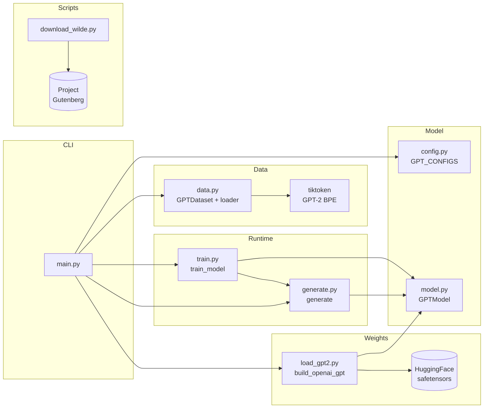
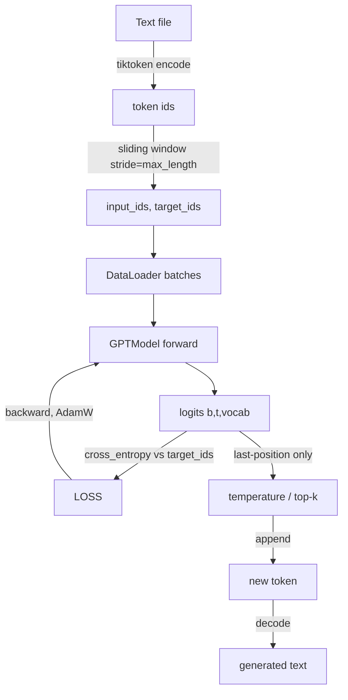
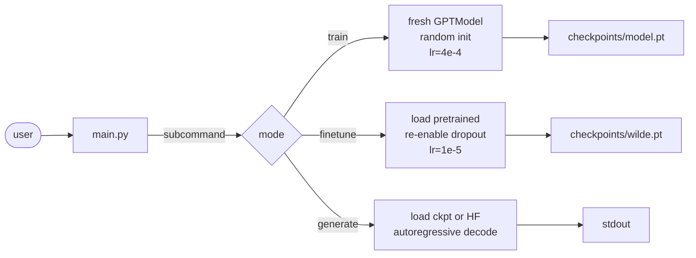

# Architecture Overview

This repository is a minimal PyTorch re-implementation of **GPT-2 small (124M)** with
enough infrastructure to train from scratch, fine-tune, and run inference with
OpenAI's pretrained weights — all from a single CLI.

## 10-second summary

| Aspect | Value |
|---|---|
| Model family | Decoder-only Transformer (GPT-2 small) |
| Parameters | ~124M (untied) / ~162.4M when positional embeddings are shrunk to `max_length=256` |
| Tokenizer | GPT-2 BPE via `tiktoken` (vocab 50,257) |
| Training objective | Next-token prediction (causal LM, cross-entropy) |
| Precision | fp32 |
| Hardware target | Single RTX 5070 (12 GB VRAM), CUDA 12.8 |
| Weight tying | `out_head.weight` is tied to `tok_emb.weight` when loading OpenAI weights |

## Module map

## High-level data flow

## Three execution modes

All entered through [../main.py](../main.py):

- **train**: cold start. Use to observe loss curves and to verify the architecture is wired correctly.
- **finetune**: warm start from OpenAI weights. Cheap, fast, and produces high-quality stylistic transfer.
- **generate**: inference from either HuggingFace weights (`gpt2`, `gpt2-medium`, …) or any saved `.pt` checkpoint.

## Why GPT-2 small?

- Fits in 12 GB VRAM with `batch_size=8`, `max_length=256`, fp32, AdamW.
- The published TF checkpoint and its HF mirror are simple (no GQA, no RoPE, no MoE).
- Pre-Norm decoder-only is the direct ancestor of every modern open-weights LLM; everything you learn here transfers.

## Design decisions worth knowing

- **Custom `LayerNorm` / `GELU`**: reimplemented to match `nn.LayerNorm` / `nn.GELU(approximate='tanh')` so the math is visible. Verified numerically equivalent.
- **Pre-Norm residuals**: `x = x + f(norm(x))` inside each [TransformerBlock](../model.py). This is what GPT-2 uses; it stabilizes training of deep stacks compared to Post-Norm.
- **Separate `W_q`, `W_k`, `W_v`**: clearer than a fused `c_attn` matrix. The weight loader splits OpenAI's fused `c_attn` into three via `torch.chunk(..., 3, dim=-1)`.
- **Boolean causal mask as a `register_buffer`**: no gradients, travels with `.to(device)`, but `persistent=False` keeps it out of `state_dict`.
- **Positional embeddings are learned, shape `(context_length, emb_dim)`**: the CLI shrinks `context_length` to `max_length` during `train` to save memory. The pretrained loader keeps the full 1024.

See [Model Internals](model.md) for the per-layer tour.
