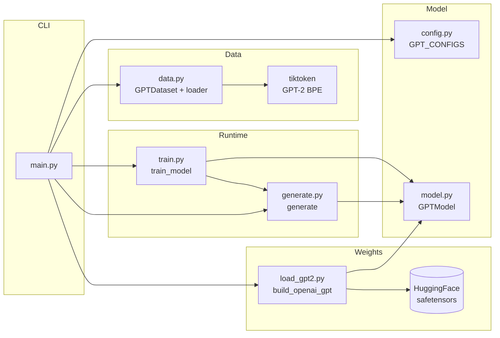
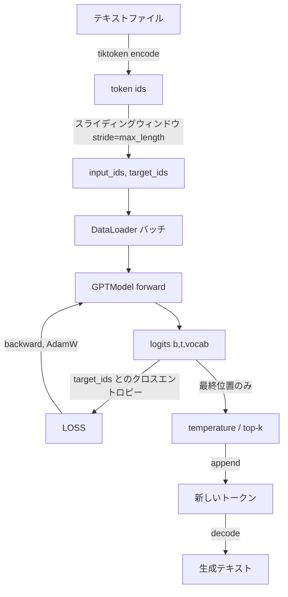
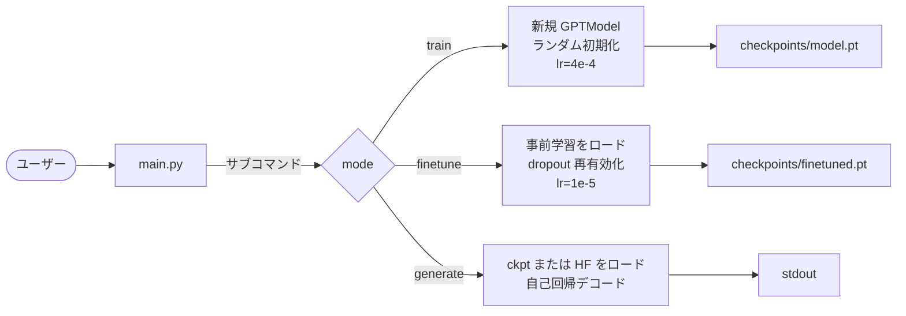

# アーキテクチャ概要

本リポジトリは **GPT-2 small (124M)** を PyTorch で最小限に再実装したものです。
スクラッチ学習、ファインチューニング、OpenAI の事前学習済み重みでの推論まで、
ひとつの CLI から実行できます。

## 10 秒サマリ

| 項目 | 値 |
|---|---|
| モデル系統 | デコーダのみの Transformer（GPT-2 small） |
| パラメータ数 | 約 124M（重み結合時） / `max_length=256` に縮めると約 162.4M（位置埋め込みを小さくした実装上の値） |
| トークナイザ | `tiktoken` の GPT-2 BPE（語彙 50,257） |
| 学習目的 | 次トークン予測（causal LM、クロスエントロピー） |
| 精度 | fp32 |
| 想定ハード | RTX 5070（12 GB VRAM）、CUDA 12.8 |
| 重み結合 | OpenAI 重みロード時に `out_head.weight` と `tok_emb.weight` を共有 |

## モジュール相関

## データフロー（俯瞰）

## 3 つの実行モード

すべて [../main.py](../main.py) から入ります。

- **train**: コールドスタート。loss カーブを観察したり、アーキテクチャの配線が正しいか確かめたりに使います。
- **finetune**: OpenAI の事前学習済み重みからウォームスタート。安価・高速で、文体転写に高い効果。
- **generate**: 推論。HuggingFace 上の GPT-2 系（`gpt2`、`gpt2-medium` など）でも、任意の `.pt` チェックポイントでも動きます。

## なぜ GPT-2 small か

- 12 GB VRAM に `batch_size=8`、`max_length=256`、fp32、AdamW でちょうど載ります。
- 公式 TF チェックポイントとその HF ミラーはシンプル（GQA も RoPE も MoE も無し）。
- Pre-Norm のデコーダのみ構成は、現代のオープン重み LLM すべての直接の祖先であり、学んだことがそのまま応用できます。

## 押さえておきたい設計判断

- **自作 `LayerNorm` ／ `GELU`**: `nn.LayerNorm` / `nn.GELU(approximate='tanh')` と数値一致するよう実装し直しています。数式を目に見える形にするのが目的。実測で等価性を確認済み。
- **Pre-Norm 残差**: 各 [TransformerBlock](../model.py) は `x = x + f(norm(x))`。GPT-2 はこれ。深いスタックでも Post-Norm より安定して学習できます。
- **`W_q`／`W_k`／`W_v` を分離**: フュージョンされた `c_attn` より読みやすい。重みロード時は `torch.chunk(..., 3, dim=-1)` で OpenAI の `c_attn` を 3 分割します。
- **Bool の causal mask を `register_buffer` で保持**: 勾配不要で、`.to(device)` にも追随。`persistent=False` なので `state_dict` には含まれません。
- **位置埋め込みは学習可能（`(context_length, emb_dim)`）**: CLI は `train` 時にメモリ節約のため `context_length` を `max_length` に縮めます。事前学習済みロード時はフルの 1024 のまま。

レイヤ単位の解説は [モデル内部](model.md) を参照。
