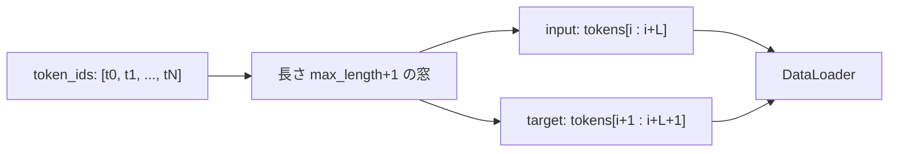

# データパイプライン

ソース: [../data.py](../data.py)

## 目的

プレーンテキストを、次トークン予測用の `(input_ids, target_ids)` ペアに変換する。
`target_ids` は `input_ids` を 1 つ左にシフトしたもの。

## トークナイザ

```python
tiktoken.get_encoding("gpt2")
```

- サブワードの BPE、**語彙サイズ 50,257**。
- OpenAI の GPT-2 トークナイザと bit 一致なので、事前学習済み重みをそのまま使える。
- `allowed_special={"<|endoftext|>"}` を渡しているので、特殊トークン 50256 を
  入力テキストに含められる（`wilde.txt` で作品境界に使用）。

## スライディングウィンドウ Dataset



ストライド `stride` ずつ開始位置 `i` を進めながら：

- `input_ids  = tokens[i : i + max_length]`（長さ L）
- `target_ids = tokens[i+1 : i+1 + max_length]`（長さ L、1 個ずらし）

既定の `stride == max_length` では窓が **重ならない**。小さい stride にすると
重なる窓になる（トークンあたりの学習シグナルが増えるが、メモリと時間も増える）。

## `create_dataloader`

```python
def create_dataloader(
    text: str,
    batch_size: int = 8,
    max_length: int = 256,
    stride: int | None = None,   # 未指定なら max_length
    shuffle: bool = True,
    drop_last: bool = True,
    num_workers: int = 0,
) -> DataLoader
```

- トークナイザを生成して `GPTDataset` を作り、`torch.utils.data.DataLoader` に包む。
- `drop_last=True` で端数バッチを捨てる。
- `num_workers=0` にしているのは Windows での spawn オーバーヘッド回避（このサイズのコーパスでは並列化の旨みが無い）。

## 学習／検証分割（[../main.py](../main.py) での使い方）

```python
split = int(len(text) * 0.9)
train_text, val_text = text[:split], text[split:]
```

文字単位の分割（トークン単位ではない）。`the-verdict.txt`（約 20K 文字）や
`wilde.txt`（約 970K 文字）程度の小さいコーパスには十分。

## バッチの shape

| テンソル | Shape | dtype |
|---|---|---|
| `input_ids` | `(batch, max_length)` | `int64` |
| `target_ids` | `(batch, max_length)` | `int64` |
| `logits = model(input_ids)` | `(batch, max_length, vocab)` | `float32` |

損失は

```python
F.cross_entropy(logits.flatten(0, 1), target_ids.flatten())
```

として、すべての `(batch, position)` ペアについて平均される。
