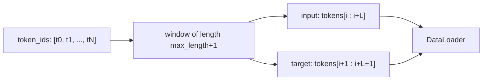

# Data Pipeline

Source: [../data.py](../data.py)

## Goal

Turn a plain text corpus into `(input_ids, target_ids)` pairs for next-token
prediction, where `target_ids` is `input_ids` shifted left by one.

## Tokenizer

```python
tiktoken.get_encoding("gpt2")
```

- Byte-pair encoding (BPE) with **vocab size 50,257**.
- Bit-identical to OpenAI's GPT-2 tokenizer, so we can reuse pretrained weights directly.
- We pass `allowed_special={"<|endoftext|>"}` so the special token `50256` can appear in the text (used in `wilde.txt` between works).

## Sliding-window dataset



For each start `i` stepping by `stride`:

- `input_ids  = tokens[i : i + max_length]`  (length L)
- `target_ids = tokens[i+1 : i+1 + max_length]` (length L, shifted by 1)

With the default `stride == max_length`, windows are **non-overlapping**; a
smaller stride would produce overlapping windows (more training signal per
token at the cost of memory and time).

## `create_dataloader`

```python
def create_dataloader(
    text: str,
    batch_size: int = 8,
    max_length: int = 256,
    stride: int | None = None,   # defaults to max_length
    shuffle: bool = True,
    drop_last: bool = True,
    num_workers: int = 0,
) -> DataLoader
```

- Instantiates the tokenizer, builds a `GPTDataset`, wraps it in a
  `torch.utils.data.DataLoader`.
- `drop_last=True` avoids a ragged final batch.
- `num_workers=0` keeps it simple on Windows (spawn overhead isn't worth it for corpora this small).

## Train/val split (used in [../main.py](../main.py))

```python
split = int(len(text) * 0.9)
train_text, val_text = text[:split], text[split:]
```

Character-level split, not token-level — good enough for small corpora like
`the-verdict.txt` (~20K chars) or `wilde.txt` (~970K chars).

## Batch shapes

| Tensor | Shape | dtype |
|---|---|---|
| `input_ids` | `(batch, max_length)` | `int64` |
| `target_ids` | `(batch, max_length)` | `int64` |
| `logits = model(input_ids)` | `(batch, max_length, vocab)` | `float32` |

The loss is then

```python
F.cross_entropy(logits.flatten(0, 1), target_ids.flatten())
```

which averages over every `(batch, position)` pair.
