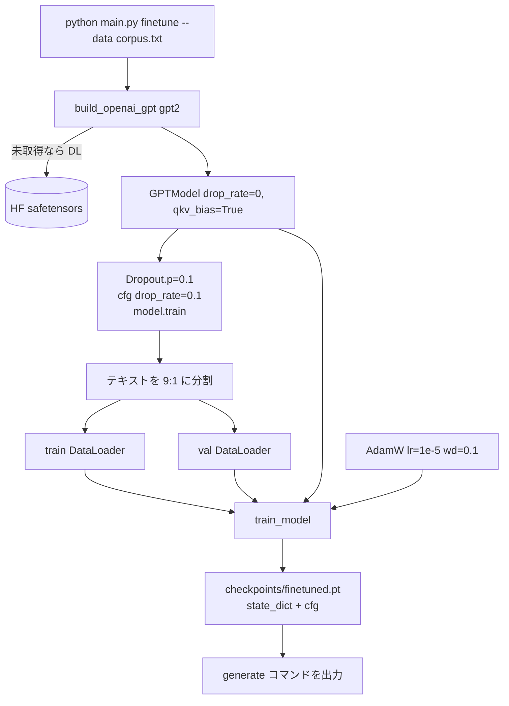

# ファインチューニング

ソース: [../main.py](../main.py) の `cmd_finetune`

## ここで言う「ファインチューニング」の意味

新しいコーパス上で言語モデルの事前学習を **継続する** こと。損失は同じ
（次トークンのクロスエントロピー）、アーキテクチャも同じ、学習率だけを
劇的に小さくします。モデルは OpenAI 事前学習で得た一般的な英語能力を保ったまま、
分布を新しいテキストに寄せていきます。

> **日本語テキストで試したい場合**: 本実装の `finetune` は OpenAI の
> 英語 GPT-2（tiktoken の GPT-2 BPE）をベースにしているため、日本語では
> 意味のある結果になりません。日本語は [../aozora/](../aozora/README.md) を
> 参照してください（`rinna/japanese-gpt2-medium` を HuggingFace Transformers で
> 扱う専用パイプラインあり）。

## フロー



## なぜ 40 倍小さい学習率か

事前学習済み重みはすでに強い最小値の近くにいます。`4e-4` のような新規学習向きの
ステップ幅ではそこを吹き飛ばして、GPT-2 が知っていることを上書きしてしまいます。
`1e-5` は GPT-2 スケールのファインチューニングでよく使われるデフォルトです。

## dropout の再有効化

`build_openai_gpt()` は推論が主目的なので `drop_rate=0.0` に設定します。
ファインチューニング前に dropout を有効化し直します:

```python
for m in model.modules():
    if isinstance(m, torch.nn.Dropout):
        m.p = 0.1
model.cfg["drop_rate"] = 0.1
model.train()
```

`model.cfg["drop_rate"]` を更新するのは重要 ―― checkpoint に保存されるからです。
次の `generate` 呼び出しは `cfg` からモデルを再構築し、そこで `.eval()` されるため
推論時に dropout は発火しません。つまり保存した値は **継続学習時** だけ意味を持ちます。

## checkpoint の互換性

[../train.py](../train.py) はモデル構築に使った `cfg` をそのまま保存するため、
`cmd_generate` は完全に同じアーキテクチャを再構築できます:

```python
ckpt = torch.load(path, weights_only=False)
cfg  = ckpt["config"]           # qkv_bias=True も含む
model = GPTModel(cfg)           # アーキテクチャ一致
model.load_state_dict(ckpt["model_state_dict"])
```

これが `python main.py generate --weights checkpoints/finetuned.pt` がそのまま動く理由です。

## コーパスの用意

`finetune` は UTF-8 のプレーンテキストを `--data` に渡すだけ。複数作品を
連結する場合は作品境界に `<|endoftext|>` を入れると事前学習時の挙動に揃います:

```python
combined = "\n\n<|endoftext|>\n\n".join(works)
```

適度な規模の目安は 500 KB〜数 MB。短すぎると過学習、長すぎると 1 epoch が
重くなります。RTX 5070 で `batch_size=4, max_length=256, lr=1e-5, epochs=3` が
ちょうど数分〜十数分で回る手応えの良いレンジ。

## 触る価値のあるノブ

- `--epochs 3` が既定。文体転写が目的なら 2〜3 epoch で train loss は下がり続けても val loss が頭打ちする典型的なカーブが出ます。そこで止める
- `--lr 1e-5` は保守的。`5e-5` まで上げる実践者もいますが、上げすぎると「忘却」のリスク
- `--max-length` は 1024 まで可（事前学習モデルが `context_length=1024` だから）。長くすると VRAM を急激に消費します
- `--base-model gpt2-medium`（355M）にすると表現力が上がる一方、lr は据え置きで OK
