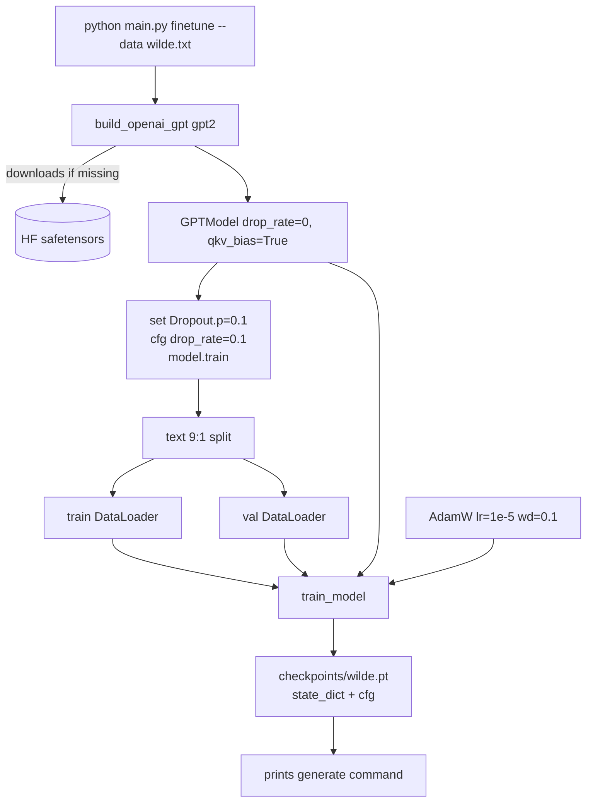

# Fine-tuning

Source: [../main.py](../main.py) (`cmd_finetune`) and [../download_wilde.py](../download_wilde.py)

## What fine-tuning means here

Continue language-model pre-training on a new corpus. Same loss
(next-token cross-entropy), same architecture, dramatically smaller
learning rate. The model retains general English competence from
the OpenAI pretraining run and shifts its distribution toward the new
text.

## Flow



## Why a 40× smaller learning rate

Pretrained weights are already close to a strong minimum. A fresh-init
learning rate like `4e-4` would blast through it and erase what GPT-2 knows.
`1e-5` is a widely used default for GPT-2-scale fine-tunes.

## Re-enabling dropout

`build_openai_gpt()` sets `drop_rate=0.0` because its primary purpose is
inference. Before fine-tuning we flip dropout back on:

```python
for m in model.modules():
    if isinstance(m, torch.nn.Dropout):
        m.p = 0.1
model.cfg["drop_rate"] = 0.1
model.train()
```

Updating `model.cfg["drop_rate"]` is important: it gets saved in the
checkpoint, and `cmd_generate` uses the stored cfg to rebuild the model.
The next `generate` call will still `.eval()` the model, which disables
dropout at inference — so the saved value only matters for continued training.

## Checkpoint compatibility

Because [../train.py](../train.py) saves the exact `cfg` used to build the
model, `cmd_generate` can rebuild it bitwise:

```python
ckpt = torch.load(path, weights_only=False)
cfg  = ckpt["config"]           # includes qkv_bias=True
model = GPTModel(cfg)           # architecture matches
model.load_state_dict(ckpt["model_state_dict"])
```

This is why `python main.py generate --weights checkpoints/wilde.pt` Just Works.

## Worked example: Oscar Wilde

`download_wilde.py` fetches five Wilde works from Project Gutenberg, strips
the boilerplate headers/footers, and joins them with `<|endoftext|>`:

```
The Importance of Being Earnest
The Picture of Dorian Gray
An Ideal Husband
Lady Windermere's Fan
A Woman of No Importance
```

Resulting `wilde.txt` ≈ 970 KB.

On an RTX 5070:

- 1 epoch, `batch_size=4`, `max_length=256`, 255 training batches.
- Wall clock ≈ 34 s.
- train loss 3.67 → 2.69, val loss 3.48 → 2.69.

Sample generation after 1 epoch with the prompt `"Marriage is"`:

> Marriage is a manly act. And if it is not allowed to be, it is not allowed to be at all. It is no longer acceptable, and it is no longer safe either for those who love me, or for those who do not. It is an obligation as much as a duty; and

Characteristically Wildean paradox and cadence, with the pretraining's grammar intact.

## Knobs worth tweaking

- `--epochs 3` is the default. For this corpus, train loss continues falling but val loss plateaus around epoch 2 — classic fine-tuning overfitting curve.
- `--lr 1e-5` is conservative. Some practitioners push to `5e-5`; go higher and you risk "forgetting".
- `--max-length` up to 1024 is fine because the pretrained model has `context_length=1024`. Longer contexts dramatically increase memory.
