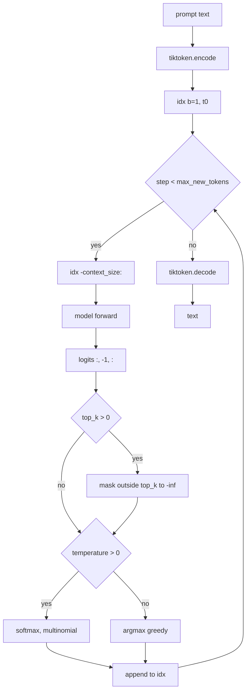

# Text Generation

Source: [../generate.py](../generate.py)

## The core loop

```python
for _ in range(max_new_tokens):
    idx_cond = idx[:, -context_size:]        # clip to context window
    logits   = model(idx_cond)[:, -1, :]     # last-position logits

    # optional top-k filter
    if top_k:
        v, _ = torch.topk(logits, top_k)
        logits[logits < v[:, -1:]] = -inf

    if temperature > 0:
        probs = softmax(logits / temperature, dim=-1)
        next_id = torch.multinomial(probs, 1)
    else:
        next_id = torch.argmax(logits, dim=-1, keepdim=True)

    idx = torch.cat([idx, next_id], dim=1)
```

## Flow diagram



## Decoding knobs

| Knob | Effect |
|---|---|
| `temperature=0` | Greedy — deterministic `argmax`. Good for sanity checks, often loops. |
| `temperature=1.0` | Sample from the raw softmax distribution. |
| `temperature<1` | "Sharper" distribution, less surprise, more repetition. |
| `temperature>1` | Flatter, more chaotic. |
| `top_k=None or 0` | No truncation. |
| `top_k=50` | Keep only the top 50 logits; a common default. |

### Greedy is deterministic — and that's a feature

The test suite exploits this: `generate(..., temperature=0)` called twice with
the same prompt must return the same string. This is a great regression guard
against hidden non-determinism (e.g. forgetting `model.eval()` so dropout
randomly fires at inference).

## Context-length handling

`idx_cond = idx[:, -context_size:]` guarantees we never feed more than
`context_length` tokens to the model, even after hundreds of generated tokens.
The oldest tokens scroll off the left — a simple "sliding" context window.

## Why only the last position?

GPT-style language models predict the *next* token at every position
simultaneously (that's how training uses `(b*t, V)` logits). At inference we
only need the prediction for the current end of the sequence, so we index
`logits[:, -1, :]`.

## Special tokens

The tokenizer is called with `allowed_special={"<|endoftext|>"}` in
[../data.py](../data.py) so prompts can contain it. The generate loop also accepts an
optional `eos_id` to stop early — it's unused from the CLI but available
programmatically.
