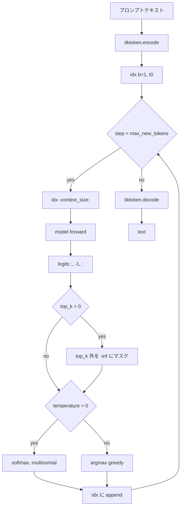

# テキスト生成

ソース: [../generate.py](../generate.py)

## コアループ

```python
for _ in range(max_new_tokens):
    idx_cond = idx[:, -context_size:]        # コンテキスト窓にクリップ
    logits   = model(idx_cond)[:, -1, :]     # 最終位置の logits

    # 任意で top-k フィルタ
    if top_k:
        v, _ = torch.topk(logits, top_k)
        logits[logits < v[:, -1:]] = -inf

    if temperature > 0:
        probs = softmax(logits / temperature, dim=-1)
        next_id = torch.multinomial(probs, 1)
    else:
        next_id = torch.argmax(logits, dim=-1, keepdim=True)

    idx = torch.cat([idx, next_id], dim=1)
```

## フロー図



## デコードのノブ

| ノブ | 効果 |
|---|---|
| `temperature=0` | Greedy ―― 決定論的な `argmax`。sanity check 向き。ループに陥りやすい。 |
| `temperature=1.0` | 生の softmax 分布からサンプリング。 |
| `temperature<1` | 分布が「シャープ」になる。驚きが減り、繰り返しが増える。 |
| `temperature>1` | 平坦化し、よりカオス。 |
| `top_k=None or 0` | 切り詰めなし。 |
| `top_k=50` | 上位 50 logits だけ残す。一般的な既定値。 |

### Greedy は決定論的 ―― そしてそれは仕様

テストでは `generate(..., temperature=0)` を同じプロンプトで 2 回呼んで、
同じ文字列が返ることを確認します。隠れた非決定性（例: `model.eval()` を忘れて
dropout が推論時に発火してしまう）に対する優れた回帰テストになります。

## コンテキスト長の扱い

`idx_cond = idx[:, -context_size:]` により、生成で何百トークン足しても、
モデルに流す入力が `context_length` を超えることはありません。古いトークンは
左から押し出されていく ―― シンプルな「スライディング」コンテキスト窓です。

## なぜ最終位置だけ？

GPT 系の言語モデルは、全位置で同時に *次の* トークンを予測します
（学習では `(b*t, V)` の logits をそのまま損失にかける理由）。
推論時は最後の位置の予測だけあれば十分なので `logits[:, -1, :]` で取り出します。

## 特殊トークン

[../data.py](../data.py) ではトークナイザを `allowed_special={"<|endoftext|>"}` で
呼んでいるので、プロンプトに含めることができます。`generate` ループには
オプションで `eos_id`（到達したら生成停止）も用意 ―― CLI からは使っていませんが
プログラマブルに利用できます。
