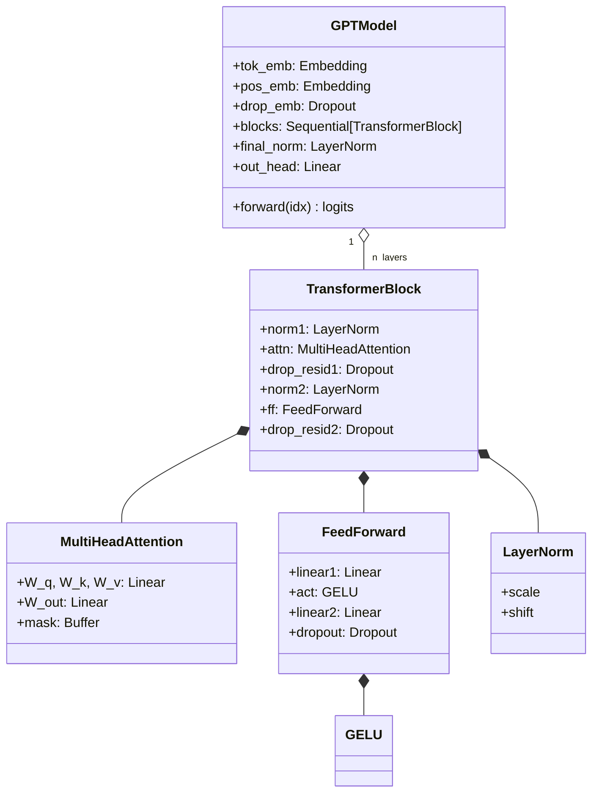
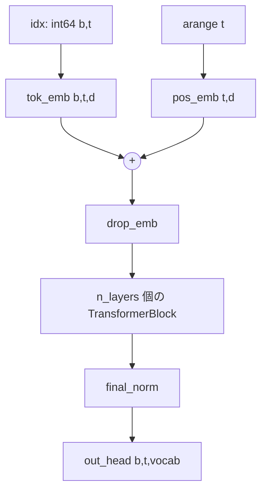
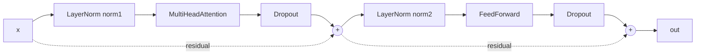
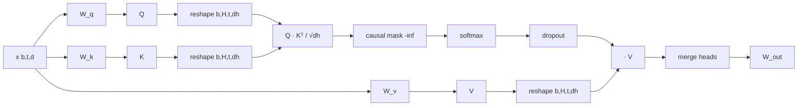

# モデル内部

ソース: [../model.py](../model.py)

Pre-Norm のデコーダのみ Transformer です。特殊な要素はありません ――
Attention、MLP、残差、ブロックごとに 2 つの LayerNorm、それだけです。

## クラス階層



## forward パス（注釈付き）



## TransformerBlock（Pre-Norm）



Pre-Norm（サブレイヤの **前** に正規化する）は GPT-2 で採用されています。
各残差ストリームに恒等経路が直結するため、非常に深い Transformer でも
安定して学習できるのが利点です。

## MultiHeadAttention

各ステップの shape を追います。

| ステップ | 演算 | Shape |
|---|---|---|
| 入力 | `x` | `(b, t, d)` |
| 射影 | `W_q(x)`、`W_k(x)`、`W_v(x)` | `(b, t, d)` |
| ヘッド分割 | `.view(b, t, H, d/H).transpose(1, 2)` | `(b, H, t, d_h)` |
| スコア | `q @ k.transpose(-2,-1) / sqrt(d_h)` | `(b, H, t, t)` |
| causal mask | `.masked_fill(mask[:t,:t], -inf)` | `(b, H, t, t)` |
| softmax + dropout | | `(b, H, t, t)` |
| 重み付き和 | `weights @ v` | `(b, H, t, d_h)` |
| ヘッド結合 | `.transpose(1,2).contiguous().view(b, t, d)` | `(b, t, d)` |
| 出力射影 | `W_out` | `(b, t, d)` |



### Causal mask

```python
mask = torch.triu(torch.ones(T, T, dtype=torch.bool), diagonal=1)
self.register_buffer("mask", mask, persistent=False)
```

- 対角より上（上三角）が `True` → そこがマスク対象。
- buffer なので `.to(device)` についてくるが、パラメータではない。
- `persistent=False` で `state_dict` には含めない（再生成が安い）。
- 推論時に短い入力が来ても動くよう `mask[:t, :t]` でスライス。

### `qkv_bias`

- **スクラッチ学習時**: `False`（論文に合わせる）。
- **OpenAI 重みロード時**: `True` ―― 公式 checkpoint が QKV バイアスを含むため。[../load_gpt2.py](../load_gpt2.py) が自動で切り替えます。

## LayerNorm（自作）

```python
mean = x.mean(dim=-1, keepdim=True)
var  = x.var(dim=-1, keepdim=True, unbiased=False)
return scale * (x - mean) / sqrt(var + eps) + shift
```

- `unbiased=False` で `nn.LayerNorm` と一致。実測の最大差は約 2e-7。
- `eps = 1e-5` は GPT-2 のデフォルト。

## GELU（tanh 近似）

$$\text{GELU}(x) = 0.5 x \left(1 + \tanh\left(\sqrt{\tfrac{2}{\pi}} \left(x + 0.044715 x^3\right)\right)\right)$$

`nn.GELU(approximate='tanh')` と bit-exact で一致することを確認済み。

## FeedForward

4 倍幅に広げる 2 層の線形変換 + 中間 GELU:

`d → 4d → GELU → d → Dropout`

## パラメータ数

GPT-2 small（`vocab=50257`、`d=768`、`L=12`、`H=12`、`ctx=1024`）の場合:

- トークン埋め込み: 50257 × 768 ≈ 38.6M
- 位置埋め込み: 1024 × 768 ≈ 0.8M
- 1 ブロックあたり: Attention 4 × (d × d) + MLP 2 × (d × 4d) + norms ≈ 7.1M → × 12 = 約 85M
- `out_head`: 768 × 50257 ≈ 38.6M（OpenAI 重みロード時は `tok_emb` と結合）

本実装は結合なしで **162.4M**（`context_length=256` 時、位置テーブルが小さい）、
フル事前学習ロード時は **163.0M** と表示します。重み結合（[../load_gpt2.py](../load_gpt2.py) が copy で実現）を入れると
実質的なパラメータ数は約 124M となり、OpenAI の公称値と一致します。
