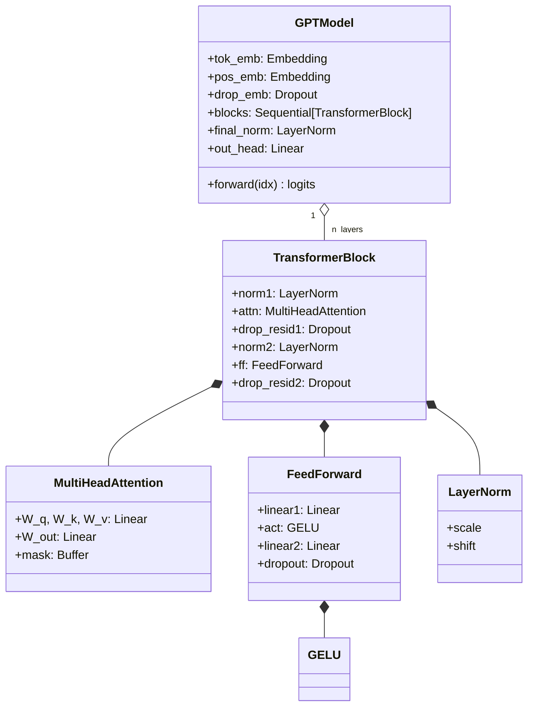
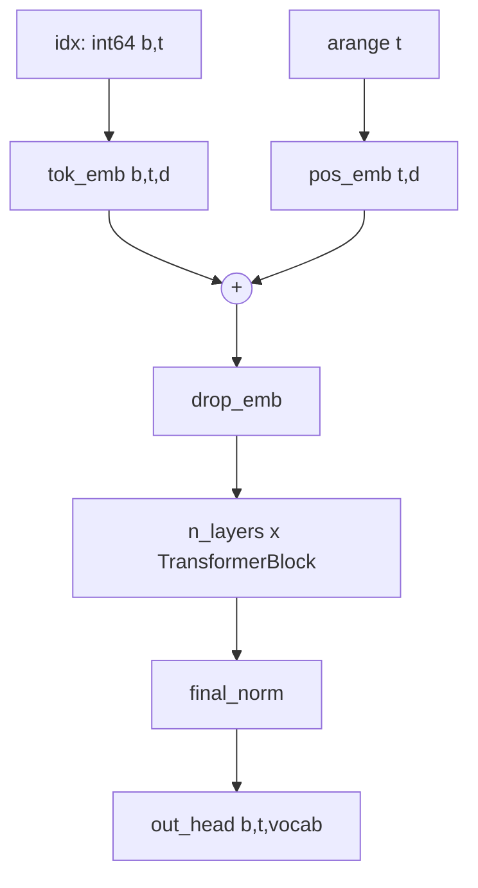
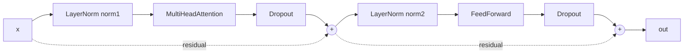
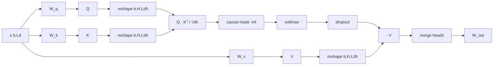

# Model Internals

Source: [../model.py](../model.py)

The model is a Pre-Norm decoder-only Transformer. Nothing exotic — just
attention, MLP, residuals, and two layer norms per block.

## Class hierarchy



## Forward pass, annotated



## TransformerBlock (Pre-Norm)



Pre-Norm (normalize **before** the sublayer) is what GPT-2 uses. It gives
every residual stream a direct identity path, which is why very deep
Transformers can be trained stably.

## MultiHeadAttention

Shapes are tracked per step:

| Step | Op | Shape |
|---|---|---|
| input | `x` | `(b, t, d)` |
| project | `W_q(x)`, `W_k(x)`, `W_v(x)` | `(b, t, d)` |
| split heads | `.view(b, t, H, d/H).transpose(1, 2)` | `(b, H, t, d_h)` |
| scores | `q @ k.transpose(-2,-1) / sqrt(d_h)` | `(b, H, t, t)` |
| causal mask | `.masked_fill(mask[:t,:t], -inf)` | `(b, H, t, t)` |
| softmax + dropout | | `(b, H, t, t)` |
| weighted sum | `weights @ v` | `(b, H, t, d_h)` |
| merge heads | `.transpose(1,2).contiguous().view(b, t, d)` | `(b, t, d)` |
| output proj | `W_out` | `(b, t, d)` |



### Causal mask

```python
mask = torch.triu(torch.ones(T, T, dtype=torch.bool), diagonal=1)
self.register_buffer("mask", mask, persistent=False)
```

- Upper triangle above the diagonal is `True` → those positions are masked.
- Registered as a buffer so it moves with `.to(device)` and is not a parameter.
- `persistent=False` keeps it out of `state_dict` (it's cheap to reconstruct).
- Sliced to `mask[:t, :t]` so shorter inputs work at inference.

### `qkv_bias`

- **Training from scratch**: `False` (matches the paper).
- **Loading OpenAI weights**: `True` — the official checkpoint includes QKV bias. [../load_gpt2.py](../load_gpt2.py) sets this automatically.

## LayerNorm (custom)

```python
mean = x.mean(dim=-1, keepdim=True)
var  = x.var(dim=-1, keepdim=True, unbiased=False)
return scale * (x - mean) / sqrt(var + eps) + shift
```

- `unbiased=False` matches `nn.LayerNorm`. Max numeric delta measured vs `nn.LayerNorm`: ~2e-7.
- `eps = 1e-5` is the default GPT-2 value.

## GELU (tanh approximation)

$$\text{GELU}(x) = 0.5 x \left(1 + \tanh\left(\sqrt{\tfrac{2}{\pi}} \left(x + 0.044715 x^3\right)\right)\right)$$

Bit-exact against `nn.GELU(approximate='tanh')` in our tests.

## FeedForward

Two linear layers with a 4× hidden expansion and GELU in between:

`d → 4d → GELU → d → Dropout`

## Parameter counts

For GPT-2 small (`vocab=50257`, `d=768`, `L=12`, `H=12`, `ctx=1024`):

- Token embeddings: 50257 × 768 ≈ 38.6M
- Positional embeddings: 1024 × 768 ≈ 0.8M
- Per block: 4 × (d × d) attention + 2 × (d × 4d) MLP + norms ≈ 7.1M → × 12 = 85M
- `out_head`: 768 × 50257 ≈ 38.6M (tied to `tok_emb` when loading OpenAI weights)

Our untied implementation reports **162.4M** parameters at `context_length=256` (smaller positional table) and **163.0M** when loading the full pretrained model. With weight tying (which [../load_gpt2.py](../load_gpt2.py) enforces via copy) the *distinct* count is ~124M, matching OpenAI's figure.
