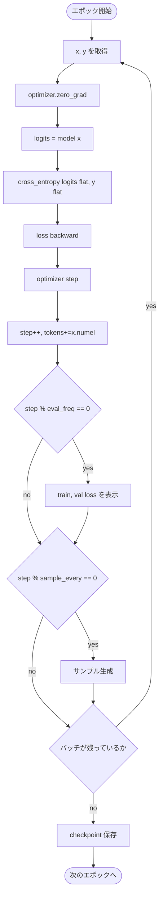

# 学習ループ

ソース: [../train.py](../train.py)

## エントリポイント

```python
train_model(
    model, train_loader, val_loader, optimizer, device,
    num_epochs,
    eval_freq=50,      # N ステップごとに train+val loss を表示
    eval_iter=5,       # 各 loss の推定に使うバッチ数
    sample_prompt="Every effort moves you",
    sample_every=None, # 未指定時は eval_freq * 4
    checkpoint_path=None,
)
```

## ステップ単位の流れ



## 損失

```python
logits = model(input_ids)                       # (b, t, V)
loss   = F.cross_entropy(
    logits.flatten(0, 1), target_ids.flatten()
)
```

- `flatten(0, 1)` で `(b, t, V)` を `(b*t, V)` に、`(b, t)` を `(b*t,)` に。
- クロスエントロピーはトークンに対して平均縮約されている。

## 評価ヘルパ

`calc_loss_loader(loader, model, device, num_batches=None)`:

- 処理中だけ `eval()` に切り替え、終了時に `train()` に戻す。
- `torch.no_grad()` で autograd メモリを節約。
- 最大 `num_batches` バッチ（`eval_iter` で指定）で平均 ―― つまり「val loss」は
  全件パスではなく安価なランニング推定値。

## チェックポイントのフォーマット

```python
torch.save(
    {
        "model_state_dict": model.state_dict(),
        "optimizer_state_dict": optimizer.state_dict(),
        "config": model.cfg,
    },
    checkpoint_path,
)
```

`config` も保存することで、`generate` 側でも同じモデルを正確に再構築できる
（ファインチューニング固有の `qkv_bias=True` や `drop_rate` も含めて）。

## サンプリングフック（学習の進行を目で見る）

`sample_every` ステップごとに [generate.py](../generate.py) を呼んで
`top_k=25, temperature=1.0` でサンプルを生成。**デバッグ上とても有用**：
loss が下がっているのにサンプルがゴミのままなら、どこかが壊れています
（mask ミス、off-by-one シフト、…）。

## ハイパーパラメータ（CLI 既定値）

| ノブ | `train` | `finetune` | 補足 |
|---|---|---|---|
| `lr` | 4e-4 | 1e-5 | 事前学習済み重みは **はるかに小さい** ステップが必要。 |
| `weight_decay` | 0.1 | 0.1 | 標準的な AdamW GPT レシピ。 |
| `batch_size` | 8 | 4 | 小さいバッチ = エポックあたりの更新回数が多い。 |
| `max_length` | 256 | 256 | `train` は位置テーブルを縮小、事前学習ロードは 1024 のまま。 |
| `epochs` | 10 | 3 | ファインチューニングは文体タスクなら数エポックで十分。 |
| `eval_freq` | 20 | 20 | |
| `sample_every` | 100 | 50 | ファインチューニングは変化を早く見たい。 |
