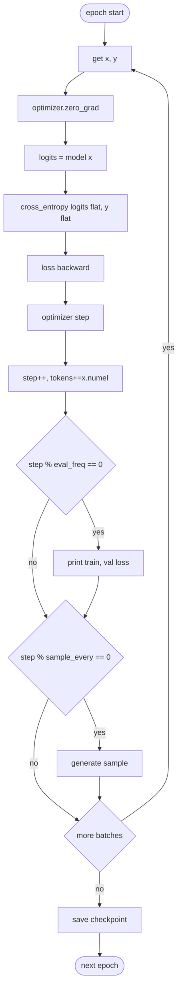

# Training Loop

Source: [../train.py](../train.py)

## Entry point

```python
train_model(
    model, train_loader, val_loader, optimizer, device,
    num_epochs,
    eval_freq=50,      # every N steps, print train+val loss
    eval_iter=5,       # N batches used to estimate each loss
    sample_prompt="Every effort moves you",
    sample_every=None, # defaults to eval_freq * 4
    checkpoint_path=None,
)
```

## Step-level flow



## Loss

```python
logits = model(input_ids)                       # (b, t, V)
loss   = F.cross_entropy(
    logits.flatten(0, 1), target_ids.flatten()
)
```

- `flatten(0, 1)` turns `(b, t, V)` into `(b*t, V)` and `(b*t,)`.
- Cross-entropy is already mean-reduced over tokens.

## Evaluation helper

`calc_loss_loader(loader, model, device, num_batches=None)`:

- Switches the model to `eval()` for the duration, then back to `train()`.
- Uses `torch.no_grad()` so no autograd memory is allocated.
- Averages over up to `num_batches` batches (set by `eval_iter`) — so "val loss" is a cheap running estimate, not a full pass.

## Checkpoint format

```python
torch.save(
    {
        "model_state_dict": model.state_dict(),
        "optimizer_state_dict": optimizer.state_dict(),
        "config": model.cfg,
    },
    checkpoint_path,
)
```

Saving `config` means `generate` can rebuild the exact model, including fine-tuning-specific flags like `qkv_bias=True` and `drop_rate`.

## Sampling hook (learning in motion)

Every `sample_every` steps the trainer calls [generate.py](../generate.py) with `top_k=25, temperature=1.0`. This is priceless for debugging: if loss is falling but samples stay gibberish, something is wrong (bad mask, off-by-one shift, …).

## Hyperparameters (CLI defaults)

| Knob | `train` | `finetune` | Note |
|---|---|---|---|
| `lr` | 4e-4 | 1e-5 | Pretrained weights need a **much** smaller step. |
| `weight_decay` | 0.1 | 0.1 | Standard AdamW GPT recipe. |
| `batch_size` | 8 | 4 | Smaller batch = more updates per epoch for fine-tune. |
| `max_length` | 256 | 256 | Shrinks positional table for `train`; pretrained keeps 1024. |
| `epochs` | 10 | 3 | Fine-tune converges very quickly on stylistic tasks. |
| `eval_freq` | 20 | 20 | |
| `sample_every` | 100 | 50 | See progress sooner on fine-tuning. |
