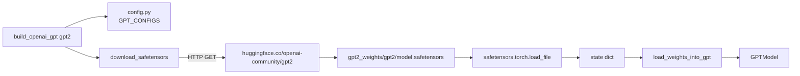

# 重みロード（OpenAI GPT-2）

ソース: [../load_gpt2.py](../load_gpt2.py)

## なぜ TF checkpoint ではなく HuggingFace safetensors か

原著は公式の TensorFlow checkpoint を使いますが、本実装では
[openai-community/gpt2](https://huggingface.co/openai-community/gpt2) ミラーの
`model.safetensors` に切り替えています。理由：

- TensorFlow は Python 3.13 以降の wheel を提供していないため、古い Python に縛られる。
- `safetensors` は小さな依存で、ロードが速く、mmap 可能。
- 重みは **同一** ―― HuggingFace は OpenAI の原本を再エクスポートしているだけ。

## ダウンロード



`SIZE_ALIASES` 経由のサイズ対応:

| 入力 | リポジトリ | HF ファイル |
|---|---|---|
| `gpt2`、`gpt2-small`、`124M` | `openai-community/gpt2` | 548 MB |
| `gpt2-medium`、`355M` | `openai-community/gpt2-medium` | 約 1.4 GB |
| `gpt2-large`、`774M` | `openai-community/gpt2-large` | 約 3.0 GB |
| `gpt2-xl`、`1558M` | `openai-community/gpt2-xl` | 約 6.2 GB |

## キーマッピング

HuggingFace の GPT-2 キーはオリジナルの **Conv1D 規約**（weight shape `(in, out)`）を
使います。一方 `nn.Linear` は `(out, in)` なので、weight はすべて転置が必要です。

| HF キー | 本実装のパラメータ | 変換 |
|---|---|---|
| `wte.weight` | `tok_emb.weight` | — |
| `wpe.weight` | `pos_emb.weight` | — |
| `h.{i}.ln_1.weight / bias` | `blocks[i].norm1.scale / shift` | — |
| `h.{i}.attn.c_attn.weight` | `blocks[i].attn.W_q / W_k / W_v.weight` | 最終軸で chunk → **転置** |
| `h.{i}.attn.c_attn.bias` | `blocks[i].attn.W_{q,k,v}.bias` | 最終軸で chunk |
| `h.{i}.attn.c_proj.weight / bias` | `blocks[i].attn.W_out.weight / bias` | **weight 転置** |
| `h.{i}.ln_2.weight / bias` | `blocks[i].norm2.scale / shift` | — |
| `h.{i}.mlp.c_fc.weight / bias` | `blocks[i].ff.linear1.weight / bias` | **weight 転置** |
| `h.{i}.mlp.c_proj.weight / bias` | `blocks[i].ff.linear2.weight / bias` | **weight 転置** |
| `ln_f.weight / bias` | `final_norm.scale / shift` | — |
| `wte.weight` | `out_head.weight` | 結合（copy） |

### フュージョンされた `c_attn`

GPT-2 は効率のため Q/K/V を `(emb, 3*emb)` の 1 行列にパックしています:

```python
c_attn_w = sd["h.0.attn.c_attn.weight"]   # (768, 2304)
q, k, v  = torch.chunk(c_attn_w, 3, dim=-1)   # (768, 768) が 3 つ
W_q.weight.copy_(q.T)                     # (out=768, in=768)
```

bias も同様に chunk するが、こちらは転置不要。

### 重み結合（weight tying）

GPT-2 は出力射影を入力埋め込みと共有します:

```python
_assign(model.out_head.weight, sd["wte.weight"])
```

「トークン *i* は何か」を引くルックアップと「次のトークンが *i* である確率」を算出する射影に
同じ行列を使う ―― 実質的に埋め込み／ヘッドのパラメータ数が半減します。

## config の調整

`build_openai_gpt()` は `GPT_CONFIGS` の値から 2 箇所を変更します:

```python
cfg["qkv_bias"]  = True   # OpenAI 重みは QKV バイアスを含む
cfg["drop_rate"] = 0.0    # 推論 ―― dropout なし
```

ファインチューニング時は [../main.py](../main.py) がロード後に dropout を再有効化します
（[ファインチューニング](finetuning.md) 参照）。

## Shape アサーション

`_assign` が全コピーをチェックします:

```python
if param.shape != value.shape:
    raise ValueError(f"shape mismatch: param {...} vs value {...}")
```

これは「転置ミス」や「層の誤ロード」といった、**一見もっともらしいが壊れた** 生成を
生む最凶のバグに対する最良の防御策です。ロード後にきちんとした英語が生成できていれば、
マッピングは端から端まで正しいことが経験的に確認できる、とも言えます。
