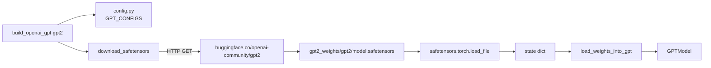

# Weight Loading (OpenAI GPT-2)

Source: [../load_gpt2.py](../load_gpt2.py)

## Why HuggingFace safetensors instead of the TF checkpoint?

The book uses the official TensorFlow checkpoint. We switched to the
[openai-community/gpt2](https://huggingface.co/openai-community/gpt2) mirror
distributed as `model.safetensors` because:

- TensorFlow has no Python 3.13+ wheels, which locks the project to old Pythons.
- `safetensors` is a tiny dependency, loads faster, and is memory-mapped.
- The weights are **identical** — HuggingFace re-exported OpenAI's originals.

## Download



Sizes mapped through `SIZE_ALIASES`:

| Input | Repo | HF file |
|---|---|---|
| `gpt2`, `gpt2-small`, `124M` | `openai-community/gpt2` | 548 MB |
| `gpt2-medium`, `355M` | `openai-community/gpt2-medium` | ~1.4 GB |
| `gpt2-large`, `774M` | `openai-community/gpt2-large` | ~3.0 GB |
| `gpt2-xl`, `1558M` | `openai-community/gpt2-xl` | ~6.2 GB |

## Key mapping

HuggingFace GPT-2 keys use the original **Conv1D convention** (weight shape
`(in, out)`), whereas `nn.Linear` uses `(out, in)`. Every weight therefore
needs a transpose.

| HF key | Our parameter | Transform |
|---|---|---|
| `wte.weight` | `tok_emb.weight` | — |
| `wpe.weight` | `pos_emb.weight` | — |
| `h.{i}.ln_1.weight / bias` | `blocks[i].norm1.scale / shift` | — |
| `h.{i}.attn.c_attn.weight` | `blocks[i].attn.W_q / W_k / W_v.weight` | chunk on last dim → **transpose** |
| `h.{i}.attn.c_attn.bias` | `blocks[i].attn.W_{q,k,v}.bias` | chunk on last dim |
| `h.{i}.attn.c_proj.weight / bias` | `blocks[i].attn.W_out.weight / bias` | **transpose weight** |
| `h.{i}.ln_2.weight / bias` | `blocks[i].norm2.scale / shift` | — |
| `h.{i}.mlp.c_fc.weight / bias` | `blocks[i].ff.linear1.weight / bias` | **transpose weight** |
| `h.{i}.mlp.c_proj.weight / bias` | `blocks[i].ff.linear2.weight / bias` | **transpose weight** |
| `ln_f.weight / bias` | `final_norm.scale / shift` | — |
| `wte.weight` | `out_head.weight` | tied (copied) |

### The fused `c_attn` tensor

GPT-2 packs Q, K, V into one `(emb, 3*emb)` matrix for efficiency:

```python
c_attn_w = sd["h.0.attn.c_attn.weight"]   # (768, 2304)
q, k, v  = torch.chunk(c_attn_w, 3, dim=-1)   # three (768, 768) each
W_q.weight.copy_(q.T)                     # (out=768, in=768)
```

Biases are chunked similarly but don't need transposing.

### Weight tying

GPT-2 ties the output projection to the input embedding:

```python
_assign(model.out_head.weight, sd["wte.weight"])
```

This ensures the "what is token *i*?" lookup and the "how likely is the next token *i*?" projection use the same matrix — halving the embedding/head parameter count in effect.

## Config adjustments

`build_openai_gpt()` deviates from the stock `GPT_CONFIGS` entry in two places:

```python
cfg["qkv_bias"]  = True   # OpenAI weights include QKV bias
cfg["drop_rate"] = 0.0    # inference — no dropout
```

For fine-tuning, [../main.py](../main.py) flips dropout back on after loading (see [Fine-tuning](finetuning.md)).

## Shape assertion

`_assign` checks every copy:

```python
if param.shape != value.shape:
    raise ValueError(f"shape mismatch: param {...} vs value {...}")
```

This is the single best defense against silently loading transposed or
wrong-layer weights — which would produce "plausible but broken" generation
that's very hard to debug. If the model generates coherent English after
loading, the mapping is correct end-to-end.
